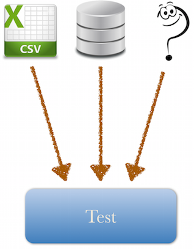
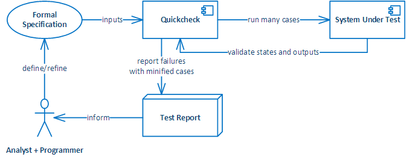
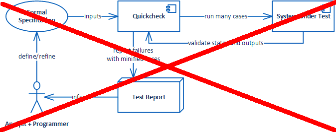

class: center, middle, cover-slide
# Realizando pruebas con Elixir/Erlang

Agustín Ramos

@MachinesAreUs

.bounce[]

---
class: middle
# ExUnit Overview

---
# Simple test case

```elixir
defmodule SimpleTest do
  use ExUnit.Case

  test "I know how to add 2 numbers" do
    assert 1 + 1 == 2
  end
end
```

--
**use ExUnit.Case** 
--

* Hace disponible la macro **test** 
--

* hace disponibles las definiciones de los módulos **ExUnit.Assertions** y **ExUnit.Callbacks** 

--

Para correr nuestra prueba usamos: 

```elixir
$ mix test 
``` 
--

```elixir
Finished in 0.04 seconds (0.04s on load, 0.00s on tests)
1 tests, 0 failures
```

---
# ExUnit.Assertions
--

Tienes todas estas:


```elixir
assert(assertion) 
assert(value, message)  
assert_in_delta(val1, val2, delta, message \\ nil)  
assert_raise(exception, function) 
assert_raise(exception, message, function)  
assert_receive(expected, timeout \\ 100, message \\ nil)     # Ojo
assert_received(expected, message \\ nil)                    # Ojo
catch_error(expression) 
catch_exit(expression)  
catch_throw(expression) 
flunk(message \\ "Flunked!")  
refute(assertion) 
refute(value, message)  
refute_in_delta(val1, val2, delta, message \\ nil)  
refute_receive(not_expected, timeout \\ 100, message \\ nil)  
refute_received(not_expected, message \\ nil) 
```
--

Ojo con **assert_receive** y **assert_received** ;-)


---
# ExUnit.Callbacks (1/2)

--
**ExUnit.Callbacks** define macros (setup, setup_all, on_exit)que se pueden utilizar para tareas de inicialización y terminación de las pruebas.

--

Ejemplo de **setup**:
--

```elixir
defmodule SetupTest do
  use ExUnit.Case

  setup do
    {:ok, [name: "agus", age: 36]}
  end

  test "it knows how to greet", context do
    name = context[:name]
    assert SUT.greet(name) == "Hello #{name}!"
  end

  test "it knows how to greet", %{name: name} do
    assert SUT.greet(name) == "Hello #{name}!"
  end

  test "it knows what year I was borned", %{age: age} do
    assert SUT.when_was_i_borned?(age) == 1979
  end
end
```

---
# ExUnit.Callbacks (2/2)

--

Ejemplo de **on_exit**:

--

```elixir
defmodule OnExitTest do
  use ExUnit.Case
  
  setup do
    context = %{name: "Agus"}
    on_exit fn -> 
      IO.puts "Cleaning up the context #{inspect context}" 
    end
    {:ok, context}
  end

  test "it knows how to greet", %{name: name} do
    assert SUT.greet(name) == "Hello #{name}!"
  end
end
```

--

```elixir
mix test test/exunit/callbacks/on_exit_test.exs
```
--

```elixir
Cleaning up the context %{name: "Agus"}
.

Finished in 0.06 seconds (0.05s on load, 0.01s on tests)
1 tests, 0 failures
```

---
# Tags (1/4)
--

A cada prueba se le puede asociar un tag de nombre y valor arbitrario. Estos tags pueden tener distintos usos.

--

**Uso #1: Agrupar tests por algún criterio**

--

```elixir
defmodule GroupingTest do
  use ExUnit.Case

  @tag :quick
  test "a test" do
    assert true
  end

  @tag :slow
  test "another test" do
    assert true
  end

  @tag :slow
  test "yet another test" do
    assert true
  end
end
```

---
# Tags (2/4)
--

```elixir
$ mix test --only slow
```

--

```elixir
Including tags: [:slow]
Excluding tags: [:test]
..
Finished in 0.1 seconds (0.1s on load, 0.00s on tests)
2 tests, 0 failures
```

---
# Tags (3/4)
--

**Uso #2: Especificar timeouts para la ejecución de la prueba.**

--

```elixir
defmodule TimeoutTest do
  use ExUnit.Case

  @tag timeout: 200 
  test "slow test" do
    :timer.sleep 500
    assert true
  end
end
```

--

```elixir
mix test test/exunit/tags/timeout_test.ex
```

--

```elixir
  1) test slow test (TimeoutTest)
     test/exunit/tags/timeout_test.ex:5
     ** (ExUnit.TimeoutError) test timed out after 200ms (you can change 
     the test timeout by setting "@tag timeout: x" where x is an integer
     in miliseconds)
```

---
# Tags (4/4)

**Uso #3: Hints para inicialización de la prueba (setup).**

Ejemplo: Indicar en algunos tests que se debe cambiar de directorio para leer archivos de recursos.

--

```elixir
defmodule FileTest do
  use ExUnit.Case

  setup context do
    # Read the :cd tag value
    if cd = context[:cd] do
      prev_cd = File.cwd!
      File.cd!(cd)
      on_exit fn -> File.cd!(prev_cd) end
    end
    :ok
  end

  @tag cd: "fixtures"
  test "reads file in /fixtures folder" do
    {:ok, line} = File.read("hello.txt")
    assert line == "Hello there\n"
  end
end

```

---
# Doctests

--

**Elixir** permite que los ejemplos de código que se utilizan en la documentación de una función, sean utilizados también como pruebas.

--

Ejemplo:

```elixir
defmodule FooCalculator do

  @doc """
    Adds two numbers. 

    Examples:

    iex> FooCalculator.add(2,3)
    5
    iex> FooCalculator.add(1.3, 2.4)
    3.5
  """
  def add(x,y) when is_number(x) and is_number(y) do
    x + y
  end
end
```

--

```elixir
defmodule FooCalculatorTest do
  use ExUnit.Case
  doctest FooCalculator
end
```

---
class: middle
# Cobertura con ExCoveralls

---
# ExCoveralls

--

Hay varias opciones de herramientas para medir la cobertura de las pruebas. ExCoveralls es suficientemente buena.

--

Configuración en mix.exs:

```elixir
def project do
  [ app: :excoveralls,
    version: "1.0.0",
    elixir: "~> 1.1.0",
    deps: deps(Mix.env),
    test_coverage: [tool: ExCoveralls],   # Importante
    preferred_cli_env: [coveralls: :test] # Importante
  ]
end

defp deps do
  [{:excoveralls, "~> 0.3", only: :test}] # Importante
end

```
--

Ejecución:

--

```elixir
mix coveralls
```
--

```elixir
mix coveralls.detail | less -R
```

---
class: middle, center
# Data Driven Testing

---
# Data Driven Testing - ¿Qué es?
--

.center[]

--

* El mismo código de prueba

--

* Ejemplos distintos tomados de cualquier fuente

---
# Data Driven Testing mediante Metaprogramación (1/2)

```elixir
defmodule DataDrivenTest do
  use ExUnit.Case

  data = [
    {1, 3, 4},
    {7, 4, 10}, # Error intencional
  ]

  for {a,b,c} <- data do
    @a a
    @b b
    @c c
    test "sum of #{@a} and #{@b} should equal #{@c}" do  
      assert SUT.sum(@a,@b) == @c 
    end
  end
end
```

---
# Data Driven Testing mediante Metaprogramación (2/2)

```elixir
mix test data_driven/data_driven_test.exs
```
--

```elixir
 1) test sum of 7 and 4 should equal 10 (DataDrivenTest)
    test/data_driven/data_driven_test.exs:14
    Assertion with == failed
    code: SUT.sum(@a, @b) == @c
    lhs:  11
    rhs:  10
    stacktrace:
      test/data_driven/data_driven_test.exs:15

Finished in 0.05 seconds (0.05s on load, 0.00s on tests)
2 tests, 1 failures
```
--

* El nombre del test fue generado para el ejemplo específico

--

* Se generaron dos pruebas, una para cada elemento de la lista **data**.

---
class: middle, center
# Property-based Testing

---
# ¿Por qué Property-based Testing?
--

Imagina que quieres probar si una función de **Erlang** es equivalente a otra de **Elixir**. Específicamente si **:lists.seq/2** (que recibe dos enteros) es equivalente a **Enum.to_list/1** (que recibe un rango).

--

```elixir
iex> :lists.seq 1, 5
[1,2,3,4,5]

iex> Enum.to_list 1..5
[1,2,3,4,5]
```
--

###.center[¿Cuántos casos distintos te conviene probar?]

--

Enfoque *naive*:

```elixir
defmodule ErlangSequenceTest do
  use ExUnit.Case

  test "erlang sequences are lists" do
    assert :lists.seq(1,5)           == Enum.to_list(1..5)
    assert :lists.seq(-10,10)        == Enum.to_list(-10..10)
    assert :lists.seq(164532,164532) == Enum.to_list(164532..164532)
  end
end
```

---
# Property-based Testing
--

La idea es que **el programador**, en lugar de especificar casos de prueba individuales, **especifica propiedades (invariantes)** que deben cumplirse sin importar los ejemplos particulares. **Una herramienta** toma la definición de estas propiedades y **genera un gran número de ejemplos**  tratando de encontrar uno para el que la propiedad no se cumpla.

--

Si llega a encontrar un ejemplo para el cual la propiedad no se cumple, trata de reducirlo a su mínima expresión (un ejemplo estructuralmente igual pero de menor tamaño) tal que siga sin cumplirse la propiedad y reporta éste último ejemplo al programador.

--

Algunos comentarios:

--

* La idea nació en el mundo de **Haskell**.
--

* Lo portaron a Erlang hace 10 años, pero no es abierto: **Quviq Erlang QuickCheck**
--

---
# Conceptos de Property-based Testing
--

##.center[Necesitamos un diagrama en UML!!!]

--

.center[]


---
# Conceptos de Property-based Testing

##.center[Necesitamos un diagrama en UML!!!]

.center[]

--

* Propiedades
* Generadores de valores
* Reducción

---
# Ejemplo 1 de Property-based Testing (1/2)
--

Tomando el ejemplo anterior...

--

```elixir
defmodule EnumProperties do
  use ExUnit.Case
  use EQC.ExUnit

  property "Erlang sequence equals Elixir list" do
    forall {m, n} <- {int, int} do
      :lists.seq(m, n) == Enum.to_list(m..n)
    end
  end
end
```

--
* **{int, int}** es un generador de tuplas de dos elementos donde cada uno es un entero.
--

* el bloque **do** interno contiene la propiedad, que debe ser un predicado (evaluar a **true** o **false**)
--

* Para cada ejemplo generado (default = 100), se comprueba si la propiedad se cumple.

---
# Ejemplo 1 de Property-based Testing (2/2)
--


```elixir
mix test test/eqc/enum_properties.exs
```

--

```elixir
....Failed! After 5 tests.
{1,0}
Shrinking x(0 times)
{1,0}

  1) test Property Erlang sequence equals Elixir list (EnumProperties)
     test/eqc/enum_properties.exs:5
     forall({m, n} <- {int, int}) do
       :lists.seq(m, n) == Enum.to_list(m .. n))
     end
     Failed for {1, 0}

     stacktrace:
       test/eqc/enum_properties.exs:5

Finished in 0.1 seconds (0.07s on load, 0.09s on tests)
1 tests, 1 failures
```

--

* La propiedad no se cumple. 
--

* El ejemplo **{1,0}** hace que falle.

---
# Ejemplo 2 de Property-based Testing (1/2)
--

Tenemos una función **reverse** que opera sobre listas. ¿Funciona?

--

**Propiedad 1**: El reverso tiene la misma longitud que la lista original.

```elixir
  property "length of reverse equals original length" do
    forall xs <- list(char) do
      xs |> reverse |> length == xs |> length
    end
  end 
```

--

**Propiedad 2**: El reverso del reverso es igual a la lista.

```elixir
  property "reverse of reverse is identity" do
    forall xs <- list(char) do
      xs |> reverse |> reverse == xs
    end
  end
```

---
# Ejemplo 2 de Property-based Testing (1/2)

Tenemos una función **reverse** que opera sobre listas. ¿Funciona?

**Propiedad 3**: Si la lista es palíndroma, su reverso es igual a la lista original.

```elixir
  property "reverse of palindrome is identity" do
    forall xs <- list(char) do
      implies is_palindrome? xs do
        reverse(xs) == xs
      end
    end     
  end
```
--

```elixir
mix test test/eqc/reverse_properties.exs
```

```elixir
...................xxx.x.x.xx....x..xx.xx.x.xxxxxxx.x.xxxx.xxx.xxxx.xxxx.x..xxxxx.x.xxxxx.xxxxxxxx.x
(x10)xx.xxxx.xxx.xxxxxxxx..(x1).......xxxxxxxxx
OK, passed 100 tests
....................................................................................................
OK, passed 100 tests
....................................................................................................
OK, passed 100 tests

Finished in 0.1 seconds (0.09s on load, 0.06s on tests)
3 tests, 0 failures
```
---
class: middle
# Pruebas de concurrencia

---
class: middle, center
##¿Por qué pruebas de concurrencia?

--
##Es Erlang... todo corre en un proceso

--
##Los procesos se ejecutan de manera concurrente

---
background-image: url(./img/pinguino.jpg) class: background-right
# ¿Cómo probar concurrencia?

--

Primero debemos tener claro:

--

* Los sistemas tienen estado. 

--

* La evolución del sistema son cambios de estado.

--

* La evolución del sistema es ocasionada por eventos.

--

Lo siguiente:

--

* Usar quickcheck para generar secuencias de eventos.

--

* De esta manera se pueden generar sequencias que ayuden a encontrar errores, es decir, estados inválidos del sistema.

--

* La reducción ayuda a entender de manera más fácil las situaciones que se presentan y llevan a un error.

---
# Ejemplo de pruebas de concurrencia 
--

###.center["Espérense al siguiente año" - **@hiphoox**]

--

.center[]

---
class: center, middle, cover-slide

#¡Happy Elixir Testing!

Agustín Ramos

@MachinesAreUs

.bounce[]
